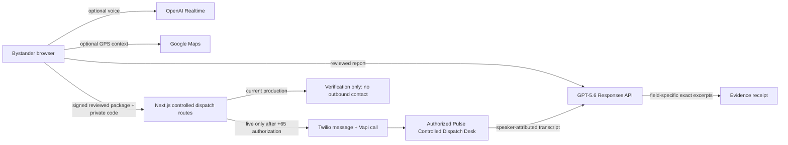

# Pulse

**A bystander-first incident brief and evidence-aware controlled handoff.**

[Live product](https://savepulse.vercel.app) · [Devpost project](https://devpost.com/software/pulse-gkw6ul) · [Build Week extension record](docs/submission/BUILD_WEEK_EXTENSION.md) · [UI exploration](docs/design/UI_DIRECTION.md) · [MIT license](LICENSE)

> [!IMPORTANT]
> Pulse is a controlled prototype. It does not contact SCDF, 995, a hospital, an ambulance provider, a patient, or a family member. For a real emergency in Singapore, call **995**. The current production release runs in **verification-only mode**: it sends no SMS or webhook and starts no call because no authorized Singapore-format controlled-desk line is configured.

## Current production release

- URL: [savepulse.vercel.app](https://savepulse.vercel.app)
- Deployed application commit: `e7e4bd9`
- Deployment: `dpl_8mHxF7LejANyF4jFFtjKrvpDTvma`, deployed around July 22, 2026 at 01:09 IST
- Verified by production health probes: GPT‑5.6, OpenAI Realtime, Vapi, and Twilio
- Unavailable: Google nearby-hospital context
- Fail-closed boundary: the configured destination did not pass the required Singapore `+65` authorization check, so production was deliberately set to `dry_run`
- Visible production QA: manual/typed journey, `gpt-5.6-sol` brief, fail-closed gate, evidence receipt, and 320/390/desktop layouts passed
- Known QA boundary: Chrome's native microphone permission remained pending
- Devpost portfolio project: saved and publicly verified at `https://devpost.com/software/pulse-gkw6ul`
- Still pending: demo video publication and an organizer-enabled late Build Week submission; the contest entry remains a closed `1/5`-step draft

Provider configuration is not evidence that an outbound operation occurred. No production message or call was made for this release.

## What Pulse is

In the first minutes after an accident, a bystander may be trying to stay with the person, explain a location, remember useful observations, and coordinate a response at the same time. Pulse turns that confusion into one reviewable sequence:

1. capture a location and witness report;
2. correct every word;
3. inspect a factual GPT‑5.6 observation brief;
4. authorize a controlled handoff or run its no-contact verification path;
5. show only outcomes supported by explicit evidence.

Pulse is deliberately not a diagnosis tool, treatment guide, public emergency-service integration, hospital router, or open-ended calling system.

## The problem

Unstructured witness reports can omit a location or mix an observation with an assumption. Emergency-domain software creates a second risk when it turns provider transport state—such as a message being accepted or a call ending—into an unsupported operational claim.

Pulse addresses both problems. GPT‑5.6 structures only what the witness actually said, and the result screen keeps these questions independent:

- Did the desk receive the brief?
- Was a responder or vehicle explicitly assigned?
- Was a destination explicitly named?
- Was an ETA explicitly stated?

Unknown stays unknown. A completed call, an assistant statement, or one generic “yes” cannot turn all four fields green.

## User journey

### 1. Capture

- Use browser geolocation or enter a Singapore address, postal code, or landmark.
- Speak through optional OpenAI Realtime transcription or type directly.
- Keep the report editable throughout capture.
- See `captured on this device`, never `shared`, before dispatch.

### 2. Review

- Correct the witness report and location before the final operation.
- Inspect the GPT‑5.6 observation brief, including visible `Unknown` values.
- Optionally view nearby hospitals from Google Maps as context only.
- See the exact destination: **Pulse Controlled Dispatch Desk**.
- Enter the private judge/demo code and confirm the reviewed package.

### 3. Verify the handoff

- Confirm the reviewed package through a short-lived, incident-bound authorization.
- In the current production release, complete a fail-closed verification run.
- Send no message or webhook and start no call while `dry_run` is active.
- Preserve independent message, call, response, and evidence states for a future authorized Singapore desk.
- Restore active polling after a refresh within the bounded status window.

### 4. Evidence receipt

- Green `Dispatch confirmed` requires explicit recipient-side vehicle assignment evidence.
- Desk receipt without assignment is amber.
- Destination and ETA remain independently unknown unless stated.
- Short recipient excerpts are shown; full provider transcripts and identifiers are not.

## Architecture



The browser never supplies a destination phone number. A short-lived HMAC session binds the client session, incident ID, report digest, location digest, timestamp, and nonce. Provider call identifiers stay inside an encrypted, client-bound polling token.

## How Pulse uses GPT‑5.6

Pulse uses the OpenAI Responses API for the production observation brief and
contains a second, live-mode evidence path for a future authorized desk call.

### Structured observation brief

The primary model is `gpt-5.6-sol`. If the account explicitly rejects that model identifier, the only compatibility fallback is the `gpt-5.6` alias. Pulse never silently substitutes a GPT‑4 model for this showcased path.

The request uses:

- `reasoning.effort: low`;
- `text.verbosity: low`;
- strict JSON Schema via `text.format`;
- `store: false`;
- a privacy-preserving `safety_identifier`;
- a bounded timeout and output budget.

The schema contains summary, incident type, consciousness, breathing, visible bleeding, people count, location detail, and missing facts. The prompt prohibits diagnosis, severity scoring, treatment instructions, hospital capability claims, dispatch claims, and inference from missing facts.

If GPT‑5.6 is unavailable, Pulse returns no fabricated fallback brief. The witness’s reviewed words remain usable unchanged.

### Controlled-call evidence

After a terminal Vapi call, Pulse preserves speaker boundaries and sends the transcript to GPT‑5.6 once. The model extracts receipt, assignment, destination, ETA, and exact recipient excerpts. Server-side validation then:

- checks each excerpt against recipient-only transcript text;
- rejects assistant-side or unattributed evidence;
- rejects a generic affirmation as vehicle assignment;
- requires explicit assignment language for a responder, unit, vehicle, crew, or ambulance;
- verifies destination text and numeric ETA independently.

## OpenAI Realtime voice

Voice is optional. When the user chooses the microphone, audio is streamed to OpenAI Realtime for live transcription. Pulse also records a bounded local audio blob and may send it to OpenAI transcription when the user stops, to produce a final transcript.

Every incident and recording receives its own identifier. Audio chunks are cleared before each recording. Once the user edits the report, late live or final transcription can populate a separate suggestion but cannot overwrite the textarea. Peer connections, data channels, media tracks, recorders, and timers are released on stop, failure, reset, and unmount.

## Controlled desk messaging and calling

The repository contains a live-capable controlled transport path, but the current production deployment does not activate it. Vapi and Twilio passed non-mutating production health probes; no authorized Singapore-format desk line is configured, so the destination gate fails closed and `PULSE_DISPATCH_MODE=dry_run` prevents all outbound contact.

- Live mode requires one fixed, authorized Singapore response line resolved server-side; none is configured for this release.
- Browser-supplied phone numbers are not accepted.
- A private demo code gates outbound contact.
- A signed session must match the reviewed report, location, incident, and client.
- Exact incident replay and rapid duplicate attempts are rejected.
- Secure status-token prerequisites are checked before external contact.
- The written brief says that receipt does not prove assignment, destination, ETA, or acceptance.
- The call introduces itself as an automated controlled prototype call.
- The assistant asks receipt, assignment, destination, and ETA separately.
- Vapi recording is disabled in the inline assistant and transport configuration.
- Call duration is capped at 90 seconds and ring timeout at 30 seconds.

### Production dry-run contract

With `PULSE_DISPATCH_MODE=dry_run`, Pulse sends **no SMS, no webhook, and no call**. The current production release uses this mode. The UI ends with `Verification only — no desk contact was made`, and every evidence field remains unknown.

## Nearby hospital context

Google Maps enrichment is optional and never blocks the controlled handoff. The production health probe currently reports it unavailable. When available in another configured environment, Pulse shows at most three nearby hospital listings ordered by estimated drive time, then straight-line distance. It may show address, map link, distance, travel time, and Google’s operational flag.

It does not infer or display trauma capability, clinical fit, capacity, acceptance, ambulance availability, or a “suitable hospital” claim. A listing is never called automatically. If the production query fails, the module says it is unavailable and the user can continue.

## Privacy and provider data flow

Pulse does not claim that data “stays private.” The actual flow is:

- microphone audio → OpenAI, only after the user chooses voice capture;
- GPS coordinates → Google Maps, only for optional nearby context;
- reviewed report and location → Pulse's server, only after the final confirmation;
- in live mode only, reviewed report and location → controlled-desk messaging/calling providers;
- in live mode only, terminal provider transcript → GPT‑5.6 for evidence extraction;
- short validated recipient excerpts → public result screen.

The app sets `Cache-Control: no-store` on incident routes, bounds report/location/audio inputs, disables Vapi recording, and does not expose phone numbers, demo codes, call IDs, full transcripts, or provider logs through public responses. Provider processing and retention remain subject to the configured providers’ behavior and account policies.

## Singapore 995 boundary

A persistent `Call 995` link is an escape for real emergencies, not a second Pulse flow. Pulse does not dial 995, represent SCDF, or claim affiliation with the Singapore government. The configured controlled response line must normalize to a Singapore `+65` number or dispatch fails closed.

## Local setup

Requirements:

- Node.js 22–24
- npm

```bash
npm install
cp .env.example .env.local
npm run dev
```

Validation:

```bash
npm run lint
npm run test:safeguards
npm run build
```

The six narrow safeguards cover token binding/encryption, exact evidence excerpts, generic-yes rejection, assistant-evidence rejection, and independent destination/ETA validation. They do not claim that a production handoff occurred. Visible production QA separately verified the current no-contact terminal state.

## Environment variables

| Variable | Purpose |
| --- | --- |
| `OPENAI_API_KEY` | GPT‑5.6 Responses, Realtime, and final transcription |
| `OPENAI_REALTIME_TRANSCRIPTION_MODEL` | Optional Realtime transcription override |
| `OPENAI_FINAL_TRANSCRIPTION_MODEL` | Optional final transcription override |
| `PULSE_DISPATCH_SESSION_SECRET` | HMAC and encrypted status-token material; required in production |
| `PULSE_DEMO_ACCESS_CODE` | Private outbound-contact gate; never commit or publish |
| `PULSE_COORDINATION_PHONE` | Canonical fixed authorized `+65` response line |
| `PULSE_OPERATOR_PHONE`, `PULSE_RECEIVING_PHONE` | Temporary legacy response-line aliases |
| `PULSE_DISPATCH_MODE` | `live` or fail-closed `dry_run` |
| `VAPI_API_KEY`, `VAPI_PHONE_NUMBER_ID` | Controlled interactive call |
| `PULSE_VAPI_MODEL`, `PULSE_VAPI_VOICE_ID` | Vapi assistant model/voice overrides |
| `TWILIO_ACCOUNT_SID`, `TWILIO_AUTH_TOKEN` | Twilio account authentication |
| `TWILIO_API_KEY_SID`, `TWILIO_API_KEY_SECRET` | Preferred scoped Twilio credentials |
| `SMS_FROM_NUMBER`, `TWILIO_FROM_NUMBER` | Controlled message sender |
| `PULSE_MESSAGE_WEBHOOK_URL`, `PULSE_MESSAGE_WEBHOOK_TOKEN` | Optional fixed HTTPS message transport |
| `GOOGLE_MAPS_API_KEY`, `GOOGLE_PLACES_API_KEY` | Optional hospital context |
| `PULSE_RATE_LIMIT_REDIS_URL`, `PULSE_RATE_LIMIT_REDIS_TOKEN` | Optional durable rate-limit store |

See [.env.example](.env.example) for the full deployment contract. Production health distinguishes `configured` from a non-mutating `verified` probe; an environment variable alone is not called ready.

## Judge testing instructions

The real demo access code belongs only in Devpost’s private judge instructions.

Recommended production verification path:

1. Open [savepulse.vercel.app](https://savepulse.vercel.app) in Chrome.
2. Choose **Start controlled verification**.
3. Enter `Marina Bay Sands, 018956`.
4. Type: `A cyclist fell near the entrance. They are awake and breathing. Their left arm may be injured. I cannot see severe bleeding.`
5. Correct one word before review.
6. Confirm that GPT‑5.6 keeps unstated fields unknown.
7. Enter the private code, confirm the report, and run the handoff once.
8. Confirm the terminal result says no desk contact was made and every evidence field remains `Unknown`.

Use synthetic data only. Do not test a real emergency or enter patient information. Production is verification-only and must not contact any number.

## What existed before Build Week

The audited baseline was commit `a83e85c` from June 5, 2026. It already contained a substantial Next.js prototype: voice/text intake, browser geolocation, AI triage, Google hospital lookup, configurable messaging and calling, status polling, and an initial interface.

It also contained serious defects: GPS and Google were dispatch gates; a selected hospital label did not match the fixed number called; one generic yes could confirm four independent claims; dry-run could still message; transcript edits could be overwritten; call state did not survive refresh; GPT‑5.6 was absent; health reported configuration as readiness; production secrets were incomplete; and the repository had no license or eligible-period extension.

## What Codex and GPT‑5.6 added during Build Week

During the eligible period, Shreyansh directed Codex to create a meaningful controlled-dispatch extension:

- a ground-up responsive, accessible interface based on clean-sheet GPT Image exploration;
- manual location and non-blocking hospital context;
- edit-safe OpenAI Realtime/final transcription lifecycle;
- GPT‑5.6 Responses migration with strict observational schema and no medical fallback;
- one fixed-destination contract with a private access gate and a required Singapore `+65` authorization check;
- fail-closed dry-run behavior;
- report/location/incident-bound dispatch authorization;
- encrypted, client-bound provider status;
- field-specific GPT‑5.6 call evidence with exact recipient-excerpt validation;
- two-minute bounded polling and refresh restoration;
- production health probes, security headers, input limits, and provider timeouts;
- MIT licensing, submission materials, and local visible E2E QA.

No commit dates were rewritten and no pre-existing work is presented as Build Week work. See the [extension record](docs/submission/BUILD_WEEK_EXTENSION.md).

## Codex collaboration

Shreyansh supplied the problem, mission, Singapore context, product boundary, and authorized testing environment. Codex performed the repository/production audit, implementation, clean-sheet visual exploration, local browser-led QA, documentation, and demo preparation under that direction. GPT‑5.6 performs runtime observation structure and, when a future authorized live call exists, evidence extraction.

This is a human-directed, Codex-executed collaboration. It would be inaccurate to claim the human had no role.

## Real QA evidence

The [QA ledger](docs/submission/QA_LEDGER.md) records the deployed commit, timestamps, viewport, scenario, outcome, evidence artifact, and known limitation. Local checks and the visible production manual/typed journey are complete; the microphone path remains blocked by Chrome's native permission prompt. Key release scenarios include:

- manual location + typed report;
- GPT‑5.6 unavailable without flow blockage;
- report edit persistence;
- Google unavailable without flow blockage;
- 320 px, 390 px, and desktop layout;
- keyboard/focus and live status semantics;
- dry-run no-contact receipt;
- duplicate-click containment;
- production GPT‑5.6 health verification and a user-visible production brief check;
- verification-only terminal evidence with no outbound contact;
- refresh recovery during status polling.

Mocked browser flows are not presented as production evidence. No real emergency service, hospital, ambulance provider, patient, family member, or unauthorized number is used in testing.

## Known limitations

- Pulse is not integrated with SCDF or any public emergency service.
- It has no official hospital, ambulance, capacity, assignment, or ETA integration.
- The current production release has no authorized Singapore-format controlled-desk destination, so outbound messaging and calling are disabled and no live evidence receipt can be demonstrated.
- Google hospital context may be unavailable and is not clinical routing evidence.
- In-memory replay protection and rate limiting are instance-local unless a durable Redis store is configured.
- Provider transcripts depend on Vapi preserving speaker attribution; without it, evidence stays unknown.
- Disabling recording in Pulse configuration cannot make claims beyond the providers’ documented behavior and account settings.
- This prototype has not undergone clinical validation, emergency-dispatch certification, legal review, privacy assessment, or accessibility certification.
- Official deployment would require formal emergency-service, clinical, privacy, legal, and operational partnerships.

## Future path

The next step is partnership work, not a broader public calling loop. With official providers, Pulse’s evidence model could be mapped to real dispatch protocols, consent and retention requirements, clinical governance, localization, reliability targets, and audited integrations. Until then, the product remains explicitly controlled.

## Design exploration

The [design direction record](docs/design/UI_DIRECTION.md) includes exact GPT Image prompts, independent no-reference directions, a weighted selection rubric, and final mobile/desktop reference boards. Those generated boards are labeled exploration only. The shipped product is accessible React and CSS; generated screenshots are not embedded as the UI or used as Devpost product evidence.

## License

Pulse is available under the [MIT License](LICENSE).
